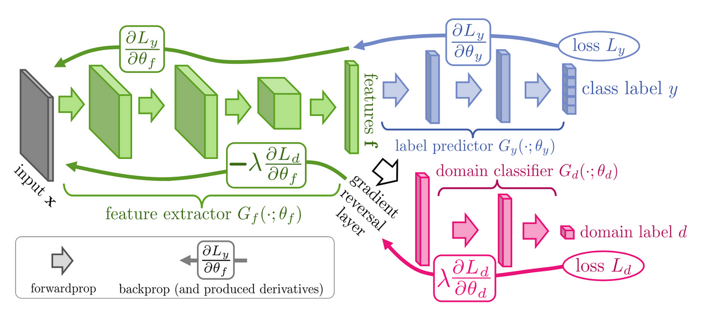

# Final project summary and descripiton can be found in the "Final Model Training and Testing" Notebook

**Citation for DANN domain dapataion technique**
**Ganin, Yaroslav, et al. Domain-Adversarial Training of Neural Networks. arXiv, 26 May 2016. arXiv.org, http://arxiv.org/abs/1505.07818.
**
https://arxiv.org/abs/1505.07818

